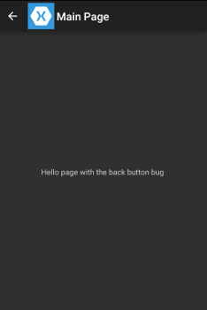

#Xamarin.Forms MasterDetailPage navigation bar bug demonstration

This repository is a self contained app to demonstrate two bugs related to the navigation bar (in Android at least) when using `MasterDetailPage` (MDP).

# Bug report

**Xamarin.Forms version:** 1.4

- MDP button in the navigation is always a back button

- `Navigation.PageSetHasNavigationBar(this,false)` is only respected in pages you navigate to, but not in the first one
    + A workarround to this is to create the `NavigationPage` with an empty page and only afterwards navigate to the real one.
```csharp
    _navPage = new NavigationPage(new Page());
    _navPage.PushAsync(new MainPage());  
```

# Expected behaviour

The MDP button should be an hamburguer menu, similar to the [Hanselman App](https://github.com/jamesmontemagno/Hanselman.Forms)

# Demonstration 

When you run the app you can confirm the first bug, 10 seconds later the app will navigate to another page, where you can confirm the second problem (ie, confirm that it only works when you navigate to and doesn't in the first page).

# Notes

- The `NavigationPage` static set methods were abused through the app to demonstrate none of the alternatives work.
